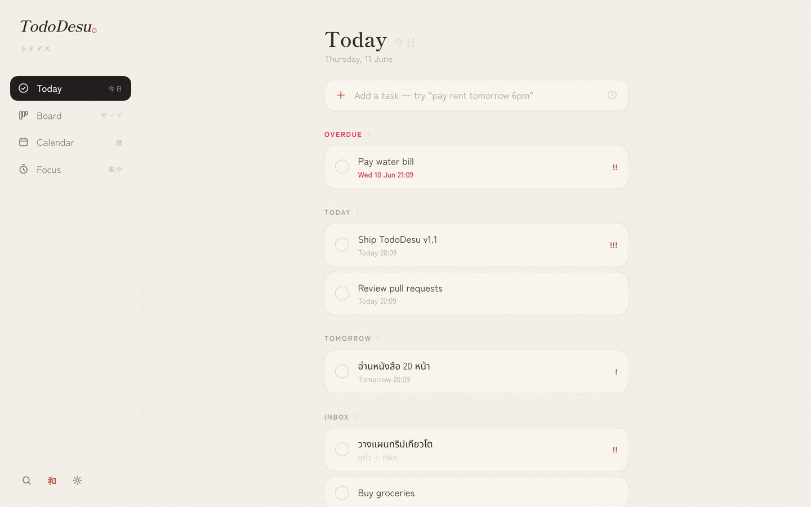
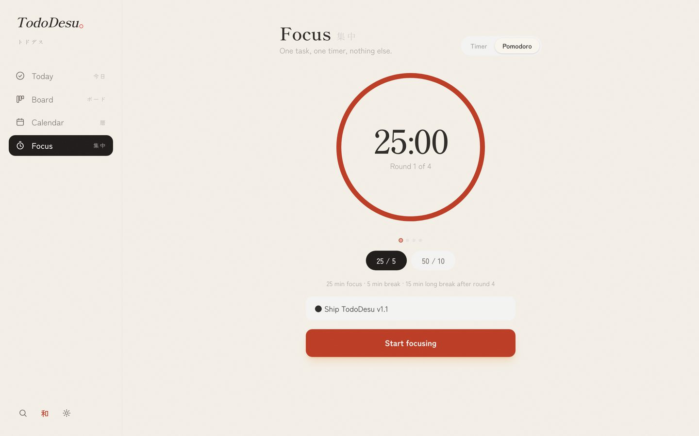
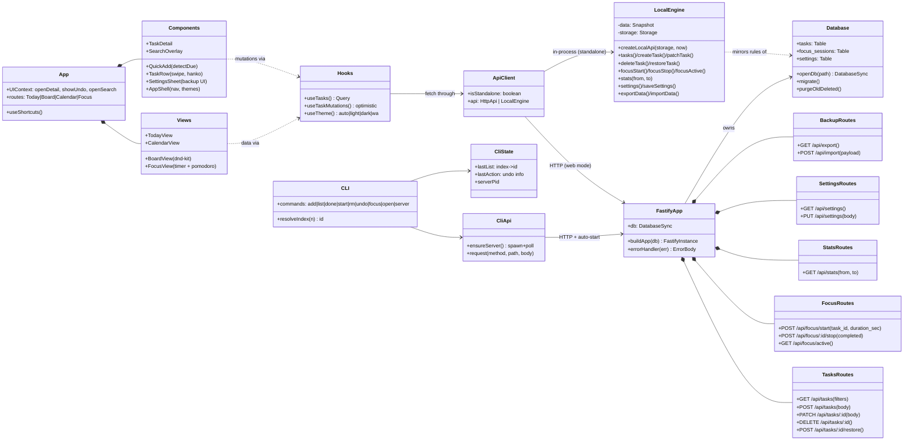

# TodoDesu トドデス。— Project Description

The full story of the project: what it is, why it exists, how it is designed, and what
the data inside it means. The technical companion (how to run, develop, and test) is
the [README](README.md); the deep code walkthrough is
[`docs/PROJECT_GUIDE.md`](docs/PROJECT_GUIDE.md).

---

## 1. Overview

**TodoDesu** (repository: `TodoDesu`) is a local-first todo application with two
equal clients sharing one source of truth: a progressive web app — Today list, kanban
board, calendar, and a Pomodoro-style focus mode — and a terminal CLI (`todo`) for
capturing tasks in seconds. Both talk to a small Fastify REST API that owns a single
SQLite file on your machine. No accounts, no cloud, no tracking.

The app also runs **fully standalone**: a browser-side data engine implements the same
business rules as the server against on-device storage. That engine powers the free
public deployment — **https://tasachii.github.io/TodoDesu/** — where each visitor's data
lives in their own browser, and the optional native iOS build.

### The problem it solves

Task *capture* and task *organization* have opposite ergonomics. Capture must be
instant — a terminal command, one input box — or tasks never enter the system.
Organization needs space — a board to drag, a calendar to scan — or the system never
gets reviewed. Existing tools optimize one and neglect the other, and the polished
ones increasingly require an account and a subscription, which means trusting a third
party with your personal task list. TodoDesu does both jobs against one local
database that the user owns outright.

### Who it's for

- Students and developers who live in the terminal but want a visual board and calendar
- Anyone using the Pomodoro technique who wants the timer wired to the task list
- Privacy-conscious people who refuse account-based, cloud-synced todo services
- Anyone with the link — the hosted version is free, installable (PWA), and serverless

### Feature highlights

- **Natural-language quick-add** — typing "pay rent tomorrow 6pm" detects the date as
  you type, shows it as a chip, and strips it from the title (with a keep-as-text
  escape hatch); dates never resolve into the past
- **Today** — Overdue / Today / Tomorrow / Inbox sections, swipe right to complete,
  swipe left to delete, five-second Undo for both
- **Board** — three-column kanban with mouse, touch, *and* keyboard drag & drop;
  positions persist via fractional ordering
- **Calendar** — month grid with task markers plus a 7-day Upcoming list
- **Focus** — a plain timer or full Pomodoro cycles (25/5 or 50/10, long break after
  round four, breaks start themselves), completion chime, daily statistics
- **CLI** — `todo add/list/done/start/rm/undo/focus/open/server`; every command
  auto-starts the server; list numbers refer to the last printed list
- **Four themes** — auto / light / dark / **Wa (和)**: washi-paper tones, sumi ink,
  one vermillion accent, Mincho type, an ensō focus ring, and a hanko 完 stamp on
  completed tasks
- **Search** (`/`), shortcuts (`n`, `1–4`, `esc`), backup export/import, PWA install,
  LAN mode for same-Wi-Fi devices

### See it

The fastest way to understand the app is to use it: **https://tasachii.github.io/TodoDesu/**
— add a task with a date in the sentence, drag it on the board, run one Pomodoro round,
and switch the theme to 和.

---

## 2. Concept

### Background

The project exists because no tool respected both halves of the todo workflow — the
two-second capture *and* the calm weekly review — without a subscription. The design
borrows deliberately: capture speed from CLI tools like taskwarrior, visual calm from
Things 3, and the aesthetic of Japanese minimalism (間 *ma* — negative space, 簡素
*kanso* — purposeful simplicity, 渋い *shibui* — quiet beauty, wabi-sabi — warm
imperfection), which eventually became the Wa theme and the TodoDesu identity. The
Pomodoro technique closes the loop: a captured task is only valuable once it gets
focused time.

A todo system works only if it is trusted and frictionless. Friction at capture means
tasks leak; lock-in and privacy doubts mean abandonment. Local-first with two
interfaces attacks both failure modes at once.

### Objectives

1. Terminal capture in ~2 seconds; web capture in a single input box.
2. The complete loop: add → focus (Pomodoro) → done (swipe/drag) → review (calendar
   and statistics).
3. One authoritative copy of the data, on the user's machine — the REST API is the
   single source of truth and the CLI never touches the database directly.
4. Correct under real conditions: timezone-safe ranges, timers that survive iOS
   suspending the page, soft delete with undo everywhere, dates that never land in
   the past.
5. Distributable at zero cost: PWA + standalone engine + GitHub Pages.
6. Engineering quality: every business rule covered by automated tests (71 across
   the three packages plus an end-to-end browser suite) run in CI on every push,
   with parity tests pinning the standalone engine to the server's behavior.

---

## 3. Architecture & Module Diagram

TodoDesu is a JavaScript monorepo (npm workspaces: `server` / `web` / `cli`). Modern
JS favors modules and factory functions over `class` syntax, so this diagram maps the
modules, their public surface, and their relationships — the same information a UML
class diagram conveys. (GitHub renders the diagram below directly on this page.)

The two relationships that define the system: the **API is the single source of
truth** (web and CLI are equal clients), and the **LocalEngine mirrors every server
rule** — enforced by a parity test suite — which is what makes the serverless
deployment possible.

---

## 4. Modules & Classes

The responsibilities at a glance — module-by-module detail, with the data flows and
the reasoning behind each design decision, lives in
[`docs/PROJECT_GUIDE.md`](docs/PROJECT_GUIDE.md) (kept in sync with the code).

| Package | Module | Responsibility |
|---|---|---|
| server | `buildApp` | Fastify factory: DB injection, uniform `{error:{code,message}}` shape, SPA fallback |
| server | `db` (openDb + migrations) | SQLite (WAL), versioned migrations, 30-day trash purge |
| server | `tasksRoutes` | CRUD rules: trimming, `completed_at` transitions, fractional ordering, soft delete |
| server | `focusRoutes` / `statsRoutes` | Single active session (409), server-computed capped durations; UTC-range aggregates |
| server | `settingsRoutes` / `backupRoutes` | Defaults-merged key-value store; atomic export/import |
| web | `createLocalApi` | The standalone engine — every server rule re-implemented over on-device storage |
| web | `api` client | One function per endpoint; picks HTTP or the engine per build/runtime |
| web | `useTasks` / `useTaskMutations` / `useTheme` | One optimistic task cache; the four-theme state machine |
| web | views (`Today/Board/Calendar/Focus`) | Screen logic — dnd-kit math, the Pomodoro four-state machine |
| web | components (`QuickAdd/TaskRow/…`) | Capture with date detection, swipe + undo, search, backup UI, shell |
| cli | `program` / `api` / `state` / `parseDue` | Subcommands with index→id mapping, server auto-start, undo state, shared date rules |

---

## 5. Statistics & Data

### How data is recorded

Statistics are a **side effect of normal use** — there is nothing to fill in:

- Every focus session writes a `focus_sessions` row: `planned_sec` and `started_at`
  at start; on stop the server computes `duration_sec = now − started_at` (capped at
  the plan, clamped ≥ 0 against device clock skew) plus a `completed` flag separating
  full rounds from early stops.
- Every task completion stamps `completed_at` — kept separate from `due_at` and
  `created_at`, and cleared if the task is reopened.
- Server mode stores everything in SQLite (`~/.todoo/data.db`, WAL); standalone mode
  stores a JSON snapshot in the browser's localStorage with identical semantics. The
  backup export/import moves data between the two, ids preserved.

### What the data supports

- `GET /api/stats?from&to` returns **`focus_sec`**, **`focus_sessions`**, and
  **`tasks_completed`** for a half-open `[from, to)` range — shown in Focus as
  "N min focused today · M sessions".
- Ranges are timezone-safe by construction: clients convert their local
  midnight–midnight to UTC, so "today" is right in any timezone and across DST.
- The same timestamp columns drive the calendar markers, the Overdue computation, the
  board's 7-day Done window, and the 30-day trash purge.
- On the roadmap, weekly charts and streaks build on these exact columns — no schema
  change needed.

---

## 6. What Changed from the Original Plan

Relative to [`docs/PLAN.md`](docs/PLAN.md):

- **Pomodoro cycles** were added to Focus (the plan had one timer with an optional
  break): presets, auto-starting breaks, a long break after the final round, and the
  style persisted server-side.
- **Distribution pivoted from the App Store to the free web.** The Capacitor iOS
  project was fully prepared (standalone engine, icons, export compliance), then
  shelved because of the Apple Developer Program cost; GitHub Pages + PWA ships the
  same standalone build for free. The iOS scaffold remains in the repo, unused.
- **The rebrand.** Todoo became **TodoDesu トドデス。**, bringing the Wa (和) theme —
  the plan specified only light/dark.
- **Added beyond the plan:** backup export/import, the search overlay, keyboard
  shortcuts, natural-language dates on the web (the plan had them CLI-only), CI, and
  the standalone engine itself.
- **Deferred as planned:** push notifications (unreliable in iOS PWAs — overdue is
  surfaced visually instead) and cross-device sync (roadmap, behind cloud + auth).

---

## 7. Credits & Licenses

Everything visual and audible in the app (icon, favicon, UI, the synthesized chime) is
original. Third-party material:

**Libraries (npm):** [Fastify](https://fastify.dev) + `@fastify/static` (MIT) ·
[React](https://react.dev) (MIT) · [React Router](https://reactrouter.com) (MIT) ·
[TanStack Query](https://tanstack.com/query) (MIT) · [dnd-kit](https://dndkit.com)
(MIT) · [framer-motion](https://www.framer.com/motion/) (MIT) ·
[Tailwind CSS v4](https://tailwindcss.com) (MIT) · [Vite](https://vite.dev) (MIT) ·
[date-fns](https://date-fns.org) (MIT) ·
[chrono-node](https://github.com/wanasit/chrono) (MIT) ·
[commander](https://github.com/tj/commander.js) (MIT) ·
[picocolors](https://github.com/alexeyraspopov/picocolors) (ISC) ·
[Capacitor](https://capacitorjs.com) (MIT) · [Vitest](https://vitest.dev) (MIT)

**Fonts (Google Fonts, SIL Open Font License 1.1):** Fraunces, Schibsted Grotesk,
Noto Sans Thai, Zen Kaku Gothic New, Shippori Mincho

**Platform:** Node.js ≥ 23.4 with the built-in `node:sqlite` (no external database
driver). This project itself is [MIT-licensed](LICENSE).
